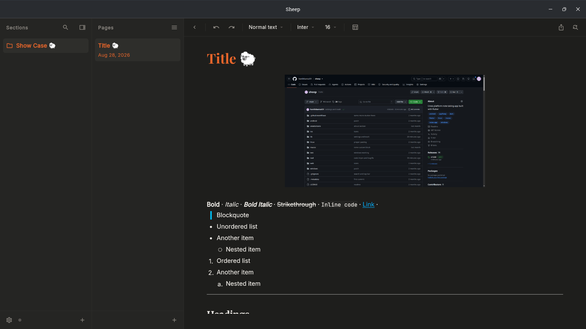
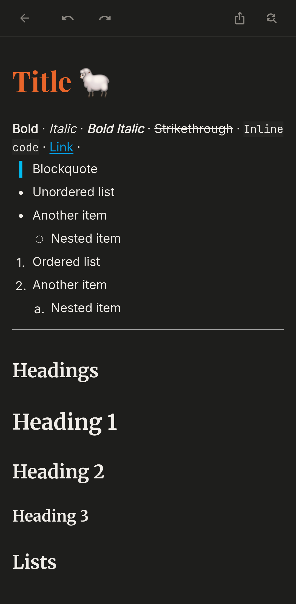
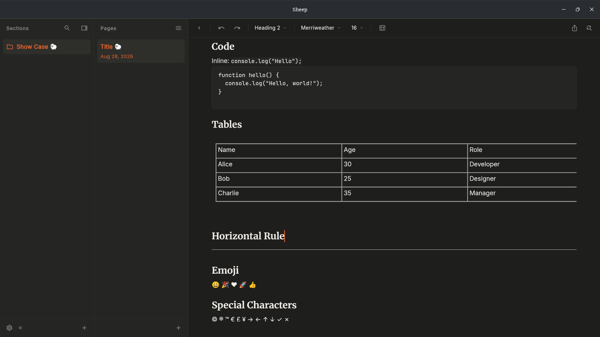
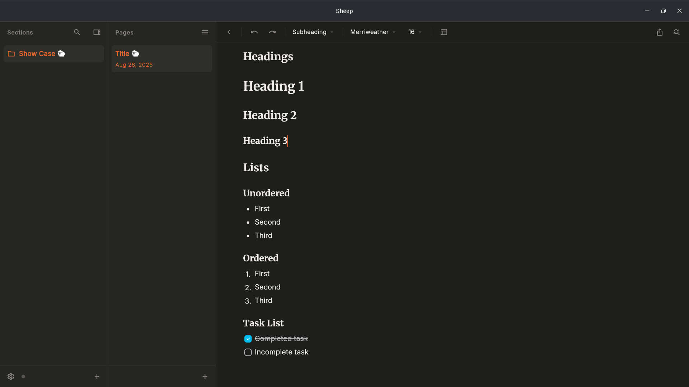

# Sheep 🐑

A beautiful, offline-first, distraction-free digital notebook designed for rapid text entry and structured note organization. Sheep strikes a perfect balance between a clean, content-first aesthetic and structured hierarchy—without the bloat.

<p align="center">
  
  
</p>

<p align="center">
  
  
</p>

---

## Key Features

*   **Offline-First & Local-First:** The app runs entirely locally. Network connection is an asynchronous optimization layer, not a dependency.
*   **JSON-Native Document Model:** Powered by [AppFlowy Editor](https://pub.dev/packages/appflowy_editor) (v6.2.0). Notes are stored as a clean JSON document tree, ensuring consistent rich-text formatting.
*   **Bi-directional Markdown Handling:**
    *   **Paste Interceptor:** Raw Markdown pasted into the editor is parsed on-the-fly and converted directly to rich JSON blocks.
    *   **Live Token Expansion:** Type Markdown shortcuts (e.g., `# `, `## `, `- `, `1. `, `[] `) to instantly format block types.
    *   **Lossless Export:** Export page contents to Markdown or print them to high-fidelity PDF.
*   **Auto-Save & Debouncing:** Content changes are debounced by 300ms–500ms before database I/O to avoid thread contention.
*   **App-Wide Search:** Full-text search (FTS5) queries both titles and page contents across your notes.

---

## Themes & Styling

All dimensions, gaps, and paddings are strictly built on a base **8px grid unit** (`8px, 16px, 24px, 32px, 48px`).

### Typography Customization
Global defaults are stored in user preferences and can be overridden per block:
*   **Titles:** Merriweather Bold
*   **Headings:** Inter Semibold
*   **Paragraphs:** Inter Regular
*   **Code / Monospace:** JetBrains Mono

### Design Tokens
*   **Light Mode:** Warm beige canvas (`#F9F8F5`), panels (`#F0EDE8`), burnt orange accents (`#CC5500`).
*   **Dark Mode:** Deep grey canvas (`#1E1E1C`), panels (`#252523`), bright orange accents (`#E8652A`).

---

## Keyboard Shortcuts Reference

Sheep offers desktop-class power-user shortcuts:

| Shortcut | Action | Description |
|---|---|---|
| `Ctrl`/`Cmd` + `K` | Search | Opens the app-wide FTS5 command palette modal |
| `Ctrl`/`Cmd` + `S` | Toggle Sections Panel | Collapses or expands the left-hand sections pane |
| `Ctrl`/`Cmd` + `T` | Toggle Pages Panel | Collapses or expands the middle pages list pane |
| `Ctrl`/`Cmd` + `,` | Settings | Opens the styling preferences and theme options modal |
| `Ctrl`/`Cmd` + `P` | Export PDF | Compiles and prints the current page to high-fidelity PDF |
| `Ctrl`/`Cmd` + `N` | New Page | Creates a new page immediately in the active section |
| `Ctrl`/`Cmd` + `.` | Bullet List | Formats the currently active cursor node into a Bullet List |
| `Ctrl`/`Cmd` + `/` | Checklist | Formats the currently active cursor node into a checkbox item |
| `Ctrl`/`Cmd` + `1` | Numbered List | Formats the currently active cursor node into an ordered list |
| `Ctrl`/`Cmd` + `Q` | Quit App | Safely saves and closes the application |

---

## Supported Platforms

| Platform | Sync Capability | Status |
|---|---|---|
| **Windows** | Full Sync (Offline + Cloud) | Working |
| **Linux (Kubuntu)** | Full Sync (Offline + Cloud) | Working (.deb) |
| **Android** | Full Sync (Offline + Cloud) | Working |
| **macOS** | Full Sync (Offline + Cloud) | Working |
| **iOS** | Full Sync (Offline + Cloud) | Untested |
| **Web** | Full Sync (Offline + Cloud) | Untested |

---

## Technology Stack

*   **Frontend Framework:** [Flutter](https://flutter.dev) (Dart SDK `^3.11.5`)
*   **Rich Text Engine:** `appflowy_editor` 6.2.0 (pinned)
*   **State Management:** `flutter_riverpod` (Scoped rebuilds, selective state subscriptions, repaint boundary isolation)
*   **Database & ORM:** `drift` + `drift_flutter` (SQLite ORM)
*   **Cloud Synchronization:** `powersync` + `supabase_flutter`
*   **Typography:** `google_fonts` (Merriweather, Inter, JetBrains Mono)
*   **Window Management:** `window_manager` (for customized desktop title bars & window states)

---

## Sync & SQLite Architecture

```text
Local User Input
       │
       ▼
[300ms-500ms Debounce] ──► Local SQLite / Drift DB ──► PowerSync Engine ──► Cloud Sync Backend (Supabase)
                                                                                  ▲
                                                                                  │
                                                                           Offline Sync Buffer
```

### Relational Schema

*   **Sections:** Flat collection with `id`, `title`, `order_index`, and tracking columns.
*   **Pages:** Document collections pointing to Sections via cascading foreign keys, containing `content_json` structures.
*   **UserPreferences:** Key-value store for active theme, layout setups, and default fonts.
*   **CustomDictionary:** Custom added words for mobile spell check.
*   **PagesSearch:** Virtual FTS5 table synchronizing plain text snippets with page content indexes for instant search.

---

## Project Structure

```text
lib/
├── main.dart                  # Application entry point, SDK/Supabase/PowerSync initializations
├── app.dart                   # Global app navigation, shortcuts, actions, and wrapper
├── core/
│   ├── database/              # Drift DB configurations, table schemas, FTS5 virtual tables
│   ├── theme/                 # AppTheme system (light/dark tokens, color parameters)
│   ├── sync/                  # PowerSync connection logic, repository layers, and Supabase connector
│   └── providers.dart         # Global core provider injections
└── features/                  # Feature-driven development folders
    ├── auth/                  # Supabase authentication screens and session management
    ├── editor/                # Custom AppFlowy editor configurations, toolbar adjustments, spellchecker
    ├── export/                # Markdown and PDF compilation, file exporter service
    ├── layout/                # Adaptive/Responsive screen builders (Desktop panels vs. Mobile sheets)
    ├── pages/                 # Page listing features, selection hooks, and data synchronization
    ├── search/                # SQLite FTS5 search modals and command palettes
    ├── sections/              # Section management (creation, cascade deletion, panel controls)
    └── settings/              # User preferences, themes, baseline font-sizing
```

---

## Getting Started

Follow these steps to set up and run the Sheep development environment:

### Prerequisites
*   [Flutter SDK](https://docs.flutter.dev/get-started/install) installed (Dart `3.11.5` / Flutter `3.41.9`)
*   Supabase and PowerSync instances configured

### Setup Instructions

1.  **Clone the Repository:**
    ```bash
    git clone https://github.com/hardikbansal31/sheep.git
    cd sheep
    ```

2.  **Install Dependencies:**
    ```bash
    flutter pub get
    ```

3.  **Generate Database Classes:**
    Drift database classes and boilerplate are generated using `build_runner`:
    ```bash
    dart run build_runner build --delete-conflicting-outputs
    ```

4.  **Configure Environment:**
    Open `lib/core/sync/sync_config.dart` and configure your Supabase URL, publishable key, and PowerSync instance URL:
    ```dart
    abstract final class SyncConfig {
      static const String supabaseUrl = 'https://your-project.supabase.co';
      static const String supabasePublishableKey = 'your-supabase-anon-key';
      static const String powerSyncUrl = 'https://your-instance.powersync.journeyapps.com';
    }
    ```

5.  **Run the Application:**
    To run on your connected device or emulator:
    ```bash
    flutter run
    ```

---

## License

This project is licensed under the MIT License - see the [LICENSE](LICENSE) file for details.
