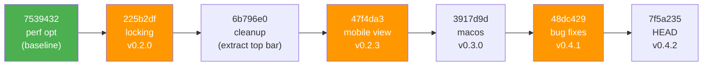
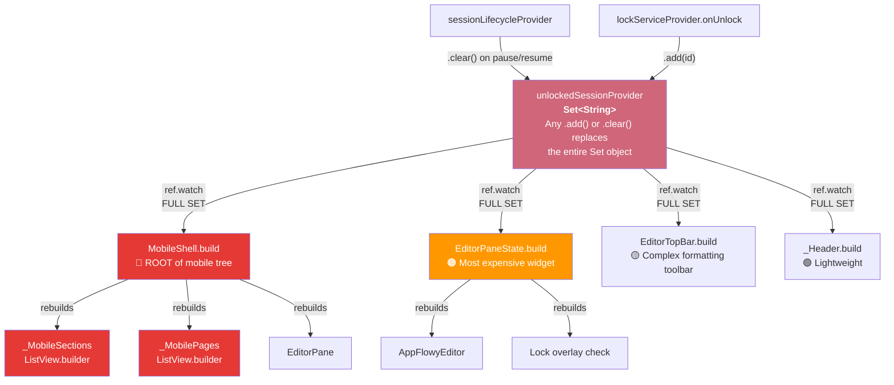

# Scroll Performance Audit — Full Git History (perf opt → HEAD)

## Timeline

| Commit | What it did (scroll-relevant) |
|--------|-------------------------------|
| `7539432` perf opt | Cached editor config, `compute()` for JSON decode, removed `ref.invalidate(fullPageProvider)` from auto-save, `FadeTransition` for sync dot. **Scroll was good here.** |
| `225b2df` **locking** (v0.2.0) | Added `ref.watch(unlockedSessionProvider)` to `_Header`, `EditorPaneState.build`, `MobileShell.build`, `EditorTopBar.build`. Added `isLocked` icon + `ref.read` in `onTap` handlers. **823 insertions.** |
| `6b796e0` cleanup | Extracted `EditorTopBar` into its own file. Structural only. |
| `47f4da3` mobile view (v0.2.3) | Removed `FloatingToolbar` wrapper from editor. Added inline `contextMenuBuilder`. Switched to platform-aware `EditorStyle.mobile`/`.desktop`. Added mobile paste button. |
| `3917d9d` macos (v0.3.0) | Added `ScrollConfiguration` wrapper (BouncingScrollPhysics, dragDevices). |
| `48dc429` bug fixes (v0.4.1) | **Removed** `ScrollConfiguration` (intentional — it caused stuttering). Replaced inline `contextMenuBuilder` with overlay-based `_onSelectionChanged` + `OverlayEntry`. Added Find & Replace. Added incremental FTS sync. Changed search hydration to N+1 loop. |

---

## What changed vs. the "perf opt" baseline

### New `ref.watch` dependencies introduced by locking (`225b2df`)

| Widget | New watch | Scope |
|--------|-----------|-------|
| `_Header` (sections_pane.dart:83) | `ref.watch(unlockedSessionProvider)` | Full `Set<String>` |
| `MobileShell.build` (mobile_shell.dart:30) | `ref.watch(unlockedSessionProvider)` | Full `Set<String>` |
| `EditorPaneState.build` (editor_pane.dart:721) | `ref.watch(unlockedSessionProvider)` | Full `Set<String>` |
| `EditorTopBar.build` (editor_top_bar.dart:595) | `ref.watch(unlockedSessionProvider)` | Full `Set<String>` |

### New widgets/listeners introduced by bug fixes (`48dc429`)

| Component | What | Cost |
|-----------|------|------|
| `_onSelectionChanged` listener | Fires on every selection change, removes `OverlayEntry` synchronously | Per-frame during drag-select |
| `ref.listen(syncStatusProvider)` in `LayoutShell` | Triggers `syncFtsIncrementally()` on sync completion | Fire-and-forget, non-reactive |
| Search hydration loop | N+1 `getPage`/`getSection` calls per result | Only when search modal open |

---

## Findings

### Issue 1 — `MobileShell.build` watches `unlockedSessionProvider` — rebuilds entire mobile tree

| | |
|---|---|
| **Location** | [mobile_shell.dart:30](file:///c:/projects/sheep/lib/features/layout/mobile_shell.dart#L30) |
| **Introduced by** | `225b2df` locking (v0.2.0) |
| **Before** | `MobileShell.build` watched only `mobileNavIndexProvider` — a single int that changes on navigation. |
| **After** | Added `ref.watch(unlockedSessionProvider)` which watches the entire `Set<String>`. |
| **Why it affects scrolling** | `MobileShell` is the **root widget** for all mobile screens. Its `build` returns the `Scaffold` containing `AnimatedSwitcher` → `_MobileSections` / `_MobilePages` / `EditorPane`. When `unlockedSessionProvider` fires (any `.add()` or `.clear()`), the entire tree rebuilds — including whichever `ListView.builder` the user is currently scrolling. The `sessionLifecycleProvider` calls `.clear()` on app resume/pause, which means **returning to the app after a brief background trip causes a full tree rebuild mid-scroll**. The only reason this watch exists is to show/hide a small lock-reset `IconButton` in the `AppBar.actions`. |
| **Severity** | **Critical** |
| **Suggested fix** | Extract the lock-reset button into a standalone `ConsumerWidget` in the `actions` list. Remove `ref.watch(unlockedSessionProvider)` from `_MobileShellState.build`. |

---

## Issue 2 — `EditorPaneState.build` watches full `unlockedSessionProvider` set

| | |
|---|---|
| **Location** | [editor_pane.dart:721](file:///c:/projects/sheep/lib/features/editor/editor_pane.dart#L721) |
| **Introduced by** | `225b2df` locking (v0.2.0) |
| **Before** | `EditorPaneState.build` watched `activePageProvider` and `settingsProvider.select(...)` — changes only on page switch or settings change. |
| **After** | Added `ref.watch(unlockedSessionProvider)` to check if the current page's session is unlocked (line 745). |
| **Why it affects scrolling** | `EditorPaneState` is the most expensive widget in the app — it contains `AppFlowyEditor`, the mobile toolbar, `AnimatedSwitcher`, and all the cached config. Every `.add()` or `.clear()` on the session set causes a full `build` of this widget. The session value is only used in one `if` check (line 745: `session.contains(page.id)`), but the watch is on the entire set. Locking/unlocking **any** item (not just the current page) triggers a rebuild. On desktop this is behind a `RepaintBoundary`, but the build/layout cost remains. On mobile, this is **compounded by Issue #1** since `MobileShell` already rebuilds, and `EditorPane` is a child. |
| **Severity** | **High** |
| **Suggested fix** | Use `ref.watch(unlockedSessionProvider.select((s) => s.contains(activePageId ?? '') || s.contains(currentSectionId ?? '')))` — the widget only needs to know if the *current* page/section is in the set, not the whole set. |

---

## Issue 3 — `_onSelectionChanged` removes `OverlayEntry` on every selection change without guard

| | |
|---|---|
| **Location** | [editor_pane.dart:99-111](file:///c:/projects/sheep/lib/features/editor/editor_pane.dart#L99-L111) |
| **Introduced by** | `48dc429` bug fixes (v0.4.1) |
| **Before** | No selection listener existed. Context menu was rendered via `contextMenuBuilder` callback (lazy, only on right-click). |
| **After** | `_onSelectionChanged` fires on **every** selection change. It unconditionally calls `_contextMenuOverlay?.remove()` and `_contextMenuOverlay = null` on each invocation, even if the overlay doesn't exist. |
| **Why it affects scrolling** | During drag-scroll with text selected, selection changes every frame. Each invocation: (1) cancels the debounce timer (cheap), (2) calls `_contextMenuOverlay?.remove()` — the `?.` means it's a no-op if null, but the function is still called per-frame. More importantly, the 300ms debounced `_showContextMenuOverlay` calls `Overlay.of(context, rootOverlay: true)` and creates a new `OverlayEntry` with a `Stack` + `Positioned` + `Material` tree. If selection is non-collapsed and the user scrolls, the debounced timer can fire during scroll, inserting an overlay (with `Positioned.fill` + `GestureDetector` covering the whole screen). This overlay **intercepts pointer events** via `HitTestBehavior.translucent`, which could steal scroll gestures. |
| **Severity** | **Medium** |
| **Suggested fix** | Don't show the context menu overlay during scroll — check if `_editorScrollController?.isScrolling` or add a scroll listener that suppresses the context menu. Alternatively, only show the overlay on right-click (as before), not on selection change. |

---

## Issue 4 — `_Header` watches `unlockedSessionProvider` — cascading rebuild risk

| | |
|---|---|
| **Location** | [sections_pane.dart:83](file:///c:/projects/sheep/lib/features/sections/sections_pane.dart#L83) |
| **Introduced by** | `225b2df` locking (v0.2.0) |
| **Before** | `_Header` watched only `settingsProvider.select(uiScale)` — very granular. |
| **After** | Added `ref.watch(unlockedSessionProvider)` to show/hide a lock-reset button. |
| **Why it affects scrolling** | `_Header` is a separate `ConsumerWidget`, so its rebuild is isolated from the `ListView.builder` sibling. However, on mobile this widget doesn't exist (mobile uses `MobileShell`'s `AppBar`). On desktop, the `RepaintBoundary` around `SectionsPane` means paint is isolated. **This is a minor concern** — the rebuild of `_Header` is cheap (just showing/hiding an `IconButton`), and it doesn't cascade to the `ListView`. |
| **Severity** | **Low** |
| **Suggested fix** | Use `.select((s) => s.isNotEmpty)` instead of watching the full set, so it only rebuilds when the set transitions between empty ↔ non-empty, not on every mutation. |

---

## Confirmed Clean (Not Issues)

| Area | Status | Why |
|------|--------|-----|
| Lock icon in list `itemBuilder` | ✅ Clean | Uses `page.isLocked` from data model (boolean field). Uses `ref.read` for session checks in `onTap`. No `ref.watch` inside builders. |
| `RepaintBoundary` wrapping | ✅ Clean | All three desktop panes and mobile editor still wrapped. No change since perf opt. |
| `SyncStatusDot` | ✅ Clean | Watches `syncStatusProvider` (a lightweight computed `Provider`). Already optimized in perf opt (FadeTransition). |
| FTS sync trigger | ✅ Clean | Uses `ref.listen` (no widget rebuild). Only fires on `syncing → synced` transition. |
| `ScrollConfiguration` removal | ✅ Intentional | User confirms this was deliberately removed because `BouncingScrollPhysics` introduced its own stuttering. |
| PIN/biometric modals | ✅ Clean | Rendered via `showDialog` (overlay), not inside scroll trees. |
| `EditorTopBar` `unlockedSessionProvider` watch | ⚠️ Minor | Same issue as `_Header` — watches full set for a single `isNotEmpty` check. But `EditorTopBar` is a `ConsumerStatefulWidget` with font selectors, so rebuilds are more expensive. Still isolated from scroll lists by `RepaintBoundary`. |

---

## Dependency Chain: `unlockedSessionProvider` Watchers

All introduced in `225b2df` (locking, v0.2.0):

---

## Final Ranked List

| Rank | Issue | Commit | Direct scroll impact |
|------|-------|--------|---------------------|
| **#1** | `MobileShell.build` watches `unlockedSessionProvider` | `225b2df` (locking) | **Rebuilds entire mobile tree including active scroll list.** Any lock/unlock or app resume triggers it. |
| **#2** | `EditorPaneState.build` watches full `unlockedSessionProvider` | `225b2df` (locking) | Rebuilds the most expensive widget on any session mutation. Compounded by #1 on mobile. |
| **#3** | `_onSelectionChanged` overlay can insert during scroll | `48dc429` (bug fixes) | Full-screen overlay with `HitTestBehavior.translucent` can intercept scroll gestures and cause visual stutter. |
| #4 | `_Header` / `EditorTopBar` watch full set | `225b2df` (locking) | Minor — isolated widgets, but `.select((s) => s.isNotEmpty)` would prevent needless rebuilds. |

> [!CAUTION]
> **Most likely primary cause:** Issue #1 — `MobileShell` watching `unlockedSessionProvider` at the root. This was introduced in the locking commit (v0.2.0) and hasn't been touched since. On mobile, every session mutation (lock, unlock, app resume) rebuilds the entire screen including whatever list is scrolling.
>
> **On desktop**, the issue is less severe due to `RepaintBoundary` isolation, but Issue #2 still causes unnecessary `EditorPaneState.build` cycles that cost layout time even if paint is skipped.
